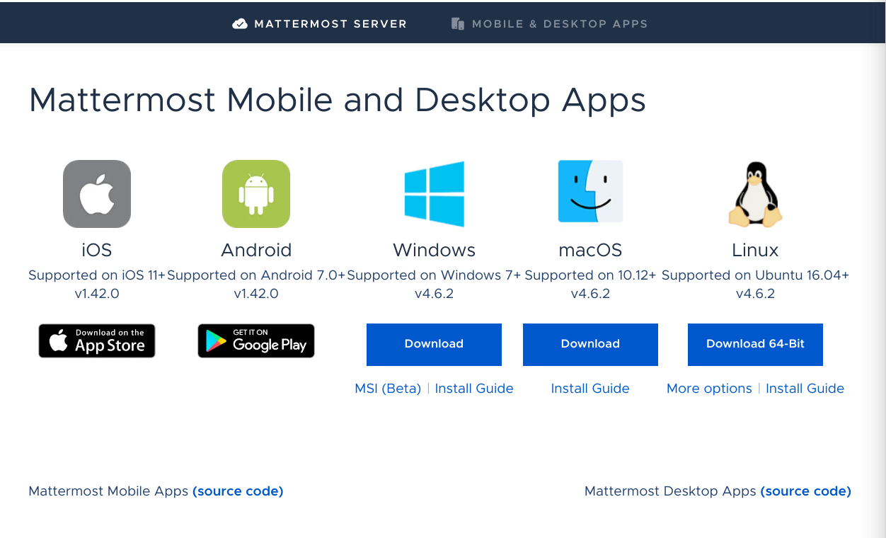
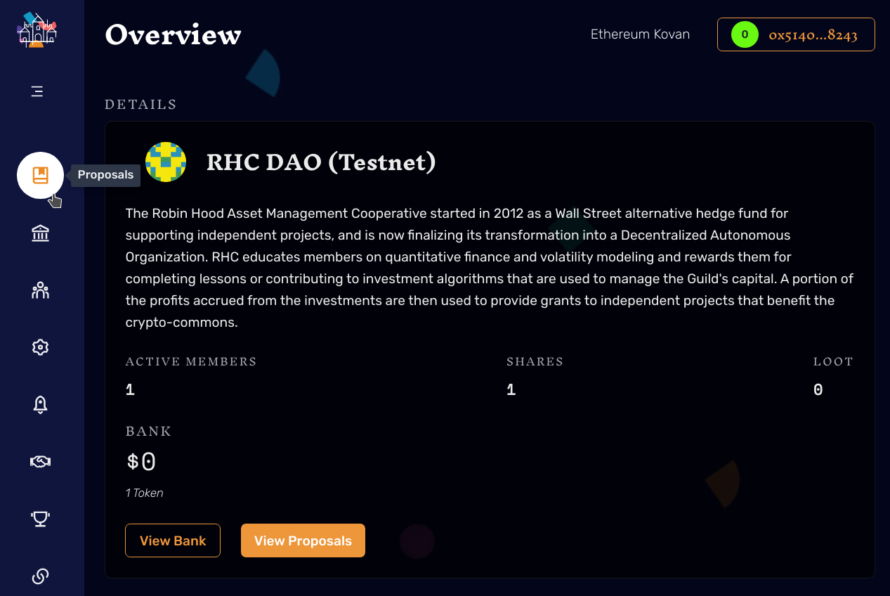
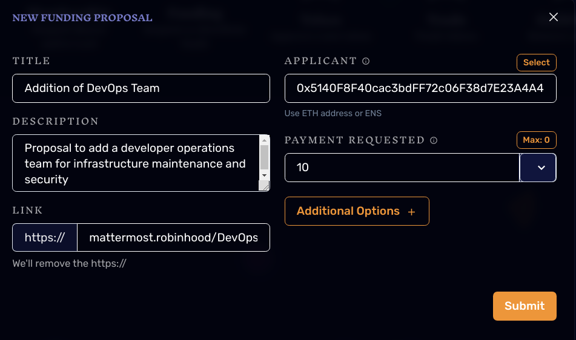
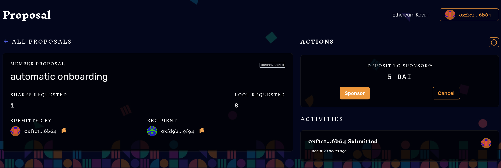
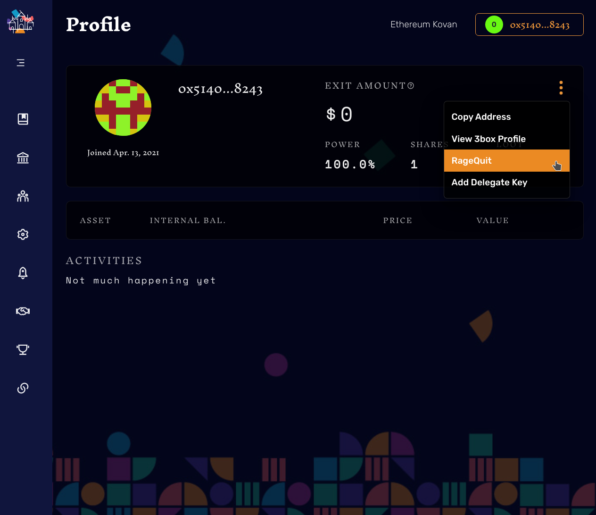

RHC Governance Protocol v1.0

## Becoming a Member 

An individual can become a member of the cooperative by submitting a [membership application](FIXME: put robinhood member app page) followed by a membership proposal on DaoHaus. Application responses will be used by Tuck to generate a membership proposal which, with the exception of omitting steps 1.1-1.3, will follow the DGP Protocol for voting and approval by the DAO. After submitting their application and receiving a membership proposal number, the prospective member will submit the proposal on DAOHaus

Upon being granted membership by the DAO, new members will receive one Membership Token, referred to in DAOHaus as a share. This token is an ERC-20 standard crypto-token representing a non-transferrable membership right, a pro-rata share of the value of the Coop Bank, and a voting right. 

The membership application will have two main sections; Personal Information and Membership Proposition. In order to maintain legal compliance, Personal Information section will collect personal information to fulfill the KYC, or, Know-Your-Customer, standard. This information is confidential and will not be shared with third-parties or other members of the DAO. The Membership Proposition section will be comprised of the following prompts, the responses to which should help provide the DAO with the information they need to assess the potential value of adding the applicant as a member:

- Please give a short introduction about yourself.
- Why do you want to join Robin Hood?
- How can you contribute to the continued growth and sustainability of Robin Hood DAO and the fulfillment of its main goals (mutual-aid through 'risking-together' and commons-oriented empowerment through grant funding)

Additionally, prospective members can apply for Loot Tokens alongside their Membership Token. Loot Tokens represent economic shares of the value of the Coop Bank, without the voting right. The purpose of having both Loot and Membership Tokens is to allow members to invest as much as they would like in the cooperative, without stripping the organization of its democratic nature. The payment for the tokens is added to the coop bank upon acceptance and paid back at exit. 

## Using DaoHaus

In our opinion, effective governance does not mean utilizing blockchain for all aspects of the process but instead, applying the technology to areas in which it provides the greatest benefit. Social interaction between humans is far too dynamic to allow for completely lossless encoding into programmatic logic. For this reason, the concept of on-chain vs off-chain is widely used in the discussion of blockchain oriented systems. Off-chain simply refers to the aspects of the system that are not enforced by programmatic logic on a smart contract, whereas on-chain refers to portions of the process that actively utilize smart-contract execution on the Ethereum Virtual Machine, resulting in trustless decentralization of the procedure. 

For aspects of our governance system that will be conducted on-chain, we will be using [DaoHaus](https://daohaus.club/). DaoHaus is a platform for interacting with Decentralized Autonomous Organization enabling smart-contracts. In reality, our smart-contract lives on all of the nodes in the ethereum network, but using DaoHaus provides us with a channel of communication to those node, so that whenever we want an action to be executed on the ethereum virtual machine our behalf, we can just use DaoHaus!

The off-chain component of our governance system is comprised of [Mattermost](https://mattermost.com/), Tuck, and [Github](https://github.com/). 

Mattermost will be our primary platform for the social coordination and communication that is necessary to make organizations function efficiently. Upon becoming a member in the DAO, you'll receive an email with the access link, which will allow you to join the conversation straight from your browser or one of their [Mobile and Desktop Apps](https://mattermost.com/download/#). 

Tuck is a proprietary chat-bot that functions as a facilitator in the off-chain governance process and a window to the state of our DAO smart-contract from within Mattermost. For v1.0 Tuck will only be able to read data from the smart-contract, but in future versions, users will be able to modify the state by submitting proposals, rage quitting, and voting all from Mattermost.

Github is a web service built on the open-source version-control tool, git. We will use github primarily to share proposals, membership applications, and other materials related to the development and operations of the coop. In v2.0 we will adopt [Radicle](https://radicle.xyz/), a peer-to-peer alternative to github that allows the DAO to integrate more tightly with the file-sharing system and file-related web3 protocols.

### Claiming a Blockchain Identity

Before you are able to interact with DaoHaus though, you need to claim your blockchain identity. When we talk about a blockchain identity, we are talking about an identification system that uses private and public keys to verify and guarantee the identity of an entity on the blockchain. An intuitive way to think about how your blockchain identity is stored is by thinking of the way in which we use business cards and drivers licenses. Your public key is like a business card, which you'd want to be published and shared as much as possible so that other people know how to get in contact with you. Your private key on the other hand, is like your drivers license, and this component is not something you want published anyhwere at all. In fact, you'd want to be the only person who has your drivers license (or private key) so that anytime someone contacts you using the information on your business card, you can verify your identity to them using the posession of your drivers license. Public and private keys are just a way to maintain your identity and interact with others in the world of blockchain. 

Since this is your identity we are talking about and you need to posess proof of your identity to trade, buy, or sell crypto-currency, it's quite important to emphasize the need for proper digital security practices. Wallets are applications that store your private keys, and while they come in many different flavors, they can generally be boiled down to two different categories; hot and cold wallets. Hot wallets are connected to the internet and therefore offer convenience when trying to interact with blockchains, but in exchange for this convenience, there is generally a much greater risk of cybertheft as anyone on the internet can try to login to your account (which is why you should always use a password manager to prevent password cracking or guessing). Cold wallets on the other hand are not connected to the internet and as such, are generally far safer than hot wallets. Cold wallets typically come in the form of a hardware (see [trezor](https://shop.trezor.io) and [ledger](https://ledger.com)) or paper wallet. For storing large amounts of crypto-currency, its always advisable to choose a cold-wallet, but for small transactions and verification of identity on browser-based applications, hot-wallets are generally more convenient.

For interaction with the DAO, you can use metamask or any walletconnect supported wallet. If this is your first wallet, we suggest using metamask; an ethereum hot-wallet that is integrated with your web-browser in order to allow for easy interaction with smart contracts. In addition to being able to store Ethereum, metamask can store any Ethereum (ERC-20, ERC-721, etc.) based coins, including the Loot and Membership tokens that are issued by the DAO. To install the browser plugin and setup an account, visit https://metamask.io/download.html.

### Customizing your Identity With IDX (formerly 3box)

So now that we know how similar a public key is to a business card, the possibility of personalization arises. When you open an account in metamask, your public key is going to look something like this: `0xba90f600cc648d3e71781d7222e45dff02012d72`. This format may be optimal for the Ethereum Virtual Machine but it's certainly not pleasant or memorable to humans! IDX is a decentralized platform for wrapping your public key in a web3 profile, allowing you to link your social media accounts, blogs, and github to the same identity. The result is an environment where your information isn't stored in a centralized server belonging to robinhood but instead on the IPFS. Currently DAOHaus has not integrated the latest version of IDX so we will not be using it until v2.0 or later, though you're free to make a 3box account in the meantime as all information will be transfered! 

### Logging in to DaoHaus
To login into the on-chain platform using your newly created identity, you will want to head over to the [DAOHaus Hub](https://app.daohaus.club/). As soon as you open the site, click the 'Connect Wallet' button in the top right. At this point, you will have the option to connect either a MetaMask or WalletConnect wallet. After choosing your wallet and signing in, your identity will be linked to DAOHaus and you'll be able to start taking interacting with DAOs!

### Accessing the DAO
# FIXME: need to check with board to decide on parameters before launching new one
Once you've logged in, you'll notice that there are a plethora of other DAOs that you can investigate and join! Magic internet communities as they call them! Once you've spent some time looking around, you'll want to head to the [Robinhood DAO Home Page](https://app.daohaus.club/dao/0x2a/0x7ebe44c487ee18994a9bb483163d6efe51947bd4). This is where you can view and interact with the state of our DAO.

### Coop Bank
We talked a little about blockchain identities and how your identity can be tied to the ownership of crypto-assets, but we never said that identites were only for humans! In fact, any entity that interacts with the blockchain must have an identity, whether i3333 smart-contract or an individual. Thus, the DAO possesses its own identiy, or pair of public/private keys which it can use to buy, sell, or trade crypto-assets. The interesting idea here is that as opposed to a single owner needing to verify transactions and approve the use of their private keys for interacting with the blockchain, the use of the DAO's private keys is dictated by the democratic voting process outlined in the DGP Protocol. This means that the DAO can own assets, the same way a bank would, except instead of a single centralized group getting to call the shots on when and what purchases should be made, the coop decides together. To view the Coop Bank, click the 'View Bank' button on the DAO Home Page. 

## DGP Protocol
In any organization, decisions must be made. In RHC 2.0, these decisions will be made by the members of the cooperative using the **DGP Protocol**. Though built using [Moloch](https://moloch.vc/), this protocol is also inspired by the [Index Coop's IIP Contribution Process](https://gov.indexcoop.com/t/iip-contribution-process/86).

Every member has the right to use the Proposal Protocol to make proposals for governance including but not limited to:

1. Membership
    - New Member Applications
    - Board Member Selection
    - Amendments to Governance Protocol
    - Amendments to Cooperative structure
2. Funding:
    - Yield Fund Fee Structure Modifications
    - Yield Fund Risk Tolerance Modifications
    - Yield Fund Investment Strategies
    - Funding for Commons-Oriented Projects
3. Token Approval:
    - Suggesting new token for the Coop to accept as tribute and/or payment
4. Trade
    - Rage Quitting 
    - Swapping tokens with the Coop Bank
5. Guild Kick
    - Forcing a member to Rage Quit 

Each member of the co-op posesses one vote (more on this in next section), and for any given proposal, the lifecycle of the proposal can be visualized as:

### 1 Informal Discussion 

#### 1.1 Proposal Drafting (Off-Chain)
The first step in this process entails drafting a preliminary proposal to be used as a starting point for informal discussion, during which, peers can help you develop the best possible version of your proposal into a final draft. Specifically, this best version is one that **is aligned with the interests of the coop as a whole**, **is logically sound and consistent**,* **clearly explains the proposed action**, and **details the necessary funding and commitment required**. The proposal drafting procedure can be described through the following steps:

1. **Review [DGP-X](https://github.com/robinhoodcoop/Proposal-Guidelines/blob/main/dgp-x.md).**
    - This is where you'll learn what a great proposal looks like! 
2. **[Fork](https://docs.github.com/en/github/getting-started-with-github/fork-a-repo) the repository by clicking "Fork" in the top right.**
    - Forking allows you to create a copy of this repository so you can draft changes (your new proposal!) and submit them to the original repository with a Pull Request! 
3. **Create your own Proposal Draft in [Markdown](https://guides.github.com/features/mastering-markdown/)**
    - DGP-X can be used as a template!
    - If your DGP requires images, the image files should be included in a subdirectory of the assets folder for that DGP as follows: assets/dgp-X (for dgp X). When linking to an image in the DGP, use relative links such as ../assets/iip-X/image.png.
4. **Submit a [Pull Request](https://docs.github.com/en/github/collaborating-with-issues-and-pull-requests/about-pull-requests)* to this repository*
   
We can't expect ourselves to create great proposals on the first try, democractic governance isn't a trivial process! The first Pull Request you submit is intended to be a rough draft that other members can use to help you evaluate the clarity and strength of your proposal before putting it into a final draft.
 
 
#### 1.2 Community Discussion (Off-Chain)

As soon as your PR is reviewed and accepted, Tuck will open up a new channel on Mattermost and send a copy of your draft to create a space for discussion around your proposal. The purpose of this stage is for you to be able to gain insight into the value of your proposal by engaging with members of the community before submitting a formal proposal. The main questions that you should be asking are things like; 

- Is the community interested in this?
- What tradeoffs will be present in the adoption of this proposal?
- How does this proposal align with the co-ops goal of enabling commons-oriented projects?

#### 1.3 Final Draft Submission (Off-Chain)

Once you believe you've been able to develop your proposal into the best possible version, update it in the forked repository from step 1.1 and submit another Pull Request! This will prompt Tuck to send the final draft in your proposals mattermost channel and a poll to guage community support. 72 hours after your final draft submission, Tuck will count the votes to determine whether or not 90% of voters supported your proposal. **If 90% of voters supported your proposal within 72 hours of Tuck posting the poll it will skip the On-Chain Voting Procedure and go straight to implementation**, otherwise, you will need to proceed to the **Debate And Smart-Contract Based Voting** step.

## 2 Debate and Smart-Contract Based Voting

Sometimes we will have proposals that are supported by over 90% of the members. In these cases, we believe it makes sense to have them implemented as soon as possible, but in other cases, we will need to come together to hear eachothers arguments for and against supporting a given proposal. In these cases, we will hold a **Governance Call** to spend some time debating and help eachother reach an educated position on the proposal, and utilize smart-contract based voting to ensure transparent and auditable results.

#### 2.1 DaoHaus Proposal (On-Chain)

After you've submitted your final draft, the next step entails visiting [DaoHaus](https://app.daohaus.club/) and submitting a proposal to the DAO smart-contract. From the DAO Home Page you should be able to access the proposal tab on the left.

You should then be prompted to choose a proposal type and submit a proposal! 

*Its important to always make sure that you include the url for the mattermost channel Tuck created in the link field*:

#### 2.2 Proposal Sponsorship (On-Chain)

Anyone can submit a proposal to the DAO, whether it is a current member, prospective member, or  grant applicant, but in order for the DAO to actually vote on it, it must first be sponsored by a current member. You can sponsor your own proposal, or a proposal belonging to someone else if you support it. Sponsoring a proposal requires a 100 DAI Deposit, 99 DAI of which is returned after the proposal is processed, regardless of the outcome. The remaining 1 DAI is reserved to incentivize processing the proposal once it is ready.

FIXME: insert picture 

#### 2.3 Governance Call (Off-Chain)

After you've submitted your proposal, a 7-day voting period will begin, and users will have 7 days to submit their vote. As soon as your proposal is submitted, Tuck will announce it to the coop and send a link for members to use to schedule the Governance Call. 48 hours after Tuck's announcement, Tuck will schedule a call for the soonest available time in which the greatest amount of members are available and announce it to the coop. Tuck will then send a reminder 1 hour before the meeting and a jitsi link when the meeting begins.

#### 2.4 DaoHaus Voting (On-Chain)

During the 7-day voting period, members have the right to vote on the proposal through DaoHaus. You can access the proposals by clicking the 'view proposals' button in the DAO Home Page.

You are only allowed to vote once on a proposal, so it's advised you wait until after the governance call to beable to hear everyone's arguments. 

The maximum number of proposals that can be processed per day is 5, meaning at any given time, there can be up to 35 proposals being voted on. 

##### 2.5 Grace Period and Rage Quitting

In order to protect members from 51% attacks and from supporting proposals they vehemently oppose, there will be a 'rage-quit' feature. At the end of the voting period, a 7-day **grace period** begins before implementation of the proposal. The purpose of the grace period is to allow members to rage quit before the changes from the proposal are implemented. During this period members who voted **No** have the opportunity to exit the co-op and collect their proportional share of tokens from the coop bank. If a proposal fails, members who voted **Yes** have the oportunity to exit and collect their shares.

You can access the ragequit functionality by navigating to the profile tab
![profile-tab.png](./assets/profile-tab.png

and clicking the drop-down menu on the right

##### 2.6 Proposal Processing

Once the grace-period has ended, anyone, even non-members can process the proposal to count the votes and finalize the state of the proposal. By processing the proposal, they are committing to implementing the changes proposed, and as such, get rewarded with 1% of the sponsorship deposit.
FIXME: add picture

## 3 Implementation

During Implementation, the changes or actions put forth by the proposal are put into place. It is the responsibility of the board to ensure that changes are made, and in future versions, higher degrees of automation will be employed such changes can be implemented automatically without any human intervention.

## DAO Update Calls

**DAO Update Calls** will occur on a monthly basis and will be used to discuss the current ongoings of the co-op, as well as current proposals, and new member applications. The time and date of the calls will be established once we onboard all legacy members and hold a vote.

## Co-op Board

Board membership positions will be proposed and voted on in the same manner as all other proposals. Once a board is established, they will be resposible for general oversight of all operations and making sure that the organization continues to be aligned with it's primary goals, facilitating transparent mutual aid between members in the form of risking-together with long-volatility investment allocations, and empowering commons-oriented projects through grant funding. There are two main responsibilities of the board:
1. Maintaining day-to-day operations and ensuring the governance system is being used effectively
2. 'Circuit-breaking' or overriding the governance system when risk-guidelines are violated. For example, if the Coop's investments begin to perform poorly enough such that an agreed upon (through the DGP Protocol) maximum level of portfolio drawdown is realized, the Board is responsible for liquidating positions to reduce exposureto excess risk and hyper-volatile events.

In order to allow for the board to execute time-sensitive decisions without submitting an entire proposal and waiting for the completion of the ~14 day process, they will be given access to a 3-of-5 multi-signaturer wallet. This wallet will allow the board to:
- request funding for the day-to-day operational expenses as per their quarterly budget proposal
- administrate the enzyme vaults and delegate access to the DAO's automated investment bots
 
#### Quarterly Budget Proposal
TODO
#### Administration of Enzyme Vaults
TODO
