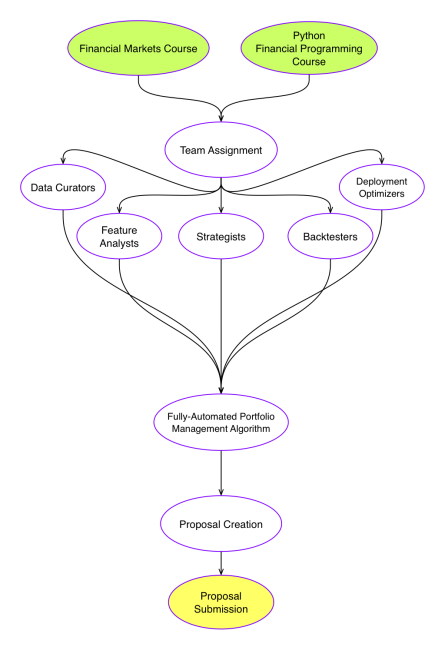

RHCDAO Strategy Creation Protocol
===============================
This document outlines the route by which members of the DAO can take in order to contribute to the Strategy Development Team receiving rewards for their contribution contingent upon acceptance of the strategy by the DAO

### Step One: Learn
Upon becoming a member of the DAO, members will have access to two recorded courses that will prepare them for becoming productive members of the Strategy Development Team.  

The first of which is a Financial Market Theory course, which will explore concepts related to Micro and Macro Market Structure as well as Long-Volatility Investing.

The second course to be offered is a Financial Python Programming Course. This course will focus on entry to intermediate level python with an emphasis on the use of LEAN, an open-source backtesting and live-trading engine.

### Step Two: Team Assignment 
Members of the Strategy Development Team will not work alone in developing strategies, but instead, will become part of a team that specializes in a specific aspect of the algorithm. Together, the five teams will be able to coordinate to synthesize fully-automated portfolio management strategies.

Teams:

- Data Curation:
    - Responsible for sourcing, cleaning, pre-processing, and storing data to be used by the strategy
- Feature Analysis:
    - Responsible for taking the data provided by Data Curation and implementing algorithmic components that generate informative signals based on the conditions of the data
- Strategy Orchestration:
    - Responsible for creating prototypical strategies that utilize the information-generating components created by Feature Analysis to piece together the Execution, Portfolio Construction, and Risk-Management aspects of the strategy
- Deployment Optimization:
    - Responsible for refactoring and optimizing strategy for execution on LEAN
- Backtesting:
    - Responsible for rigorously testing the efficacy of the strategy and creating performance reports to be used in the proposal.

Each team will have a single team leader. Once a member completes the educational courses, they will schedule an interview with the team leaders. After this interview, team leaders will decide where to place the member based on their interests and abilities.

### Step Three: Collaborative Development
Once a member is part of a team, their team leader will assign tasks based on the currently in-progress strategies. The team leader will also be responsible for coordinating with the other team leaders in order to develop a plan-of-action for each strategy, as well as track contribution among team members. Team leaders will be elected by the DAO and can be removed or replaced at anytime contingent upon the passing of a proposal.

### Step Four: Strategy Creation
To illustrate the strategy creation process, The following is an example of how a simple strategy would be created

Any member of the DAO can suggest a strategy to be implemented, but ultimately the team leaders (given their experience) will decide which strategies will be part of the development efforts. Suppose the team leaders decide to implement a strategy suggested by a DAO member that buys stocks based on the amount of tweets mentioning that stock over the last 24 hours.

After deciding on the new project and announcing it to the DAO, work begins. 

Data Curation is responsible for creating the algorithmic component that retreives, cleans, and stores the twitter data to be used by the strategy.

Feature Analysis is responsible for creating the algorithmic component that parses the tweets to determine which stock they mention, and maintain a record of the number of mentions for each stock

Strategy Orchestration is responsible for creating the prototypical strategy that uses the two aforementioned components as well as creating the mechanism that decides how many mentions are required for a stock to be bought, how much capital to put on each stock, and when to sell the stock.

Deployment Optimization is responsible for optimizing the prototype so that when launched, it can be executed as quickly and efficiently as possible.

Backtesting is responsible for rigorously testing this strategy and creating a performance report that outlines key statistics such as annual profit-and-loss, max-drawdown, sharpe ratio, etc. 

### Step Five: Proposal Creation
Once a strategy is created, all members who worked on the strategy will collaborate to create a Proposal for the deployment of their strategy. This proposal will consist of three main areas; Strategy Performance Summary, Allocation Requested, and Compensation Requested

- Strategy Performance Summary:
    - Provided by the Backtesting Team, this section will outline key performance statistics from multiple backtest periods. This section will be heavily utilized by DAO members in order to determine if the risk-appetite of the strategy aligns with the appetite of the DAO as a whole.
- Allocation Requested:
    - Provided by the Strategy Orchestration Team, this section identifies the amount of capital requested for allocation on this strategy upon deployment.
- Compensation Requested:
    - Provided by the entire group of members who worked on this project (excluding backtesters), this section outlines the number of shares to be given to the members as compensation for the creation of this strategy if it is accepted by the DAO.

Backtesters are excluded from the compensation requested in order to prevent bias in their testing, for if they are rewarded proportional to the performance of the strategy, they would be incentivized to test the strategies with less rigor, leading to higher performing strategies and higher compensation. Instead, backtesters are compensated on a monthly basis at a rate determined by the DAO through proposals.

### Step Six: Proposal Submission 
After a proposal has been created, one of the team leaders is elected by the strategy development team to submit the proposal to the DAO for review under the Proposal Protocol.

